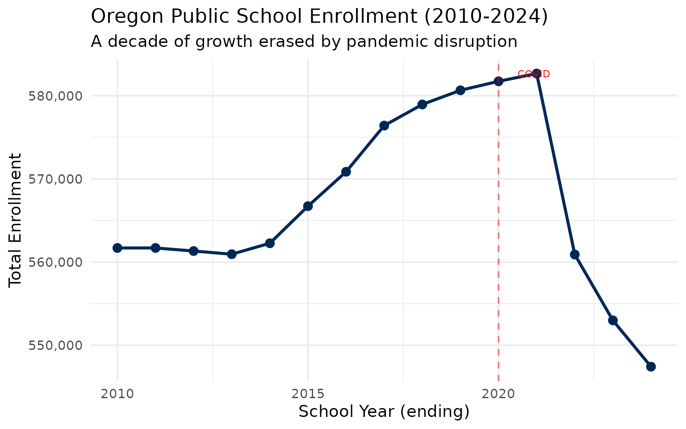
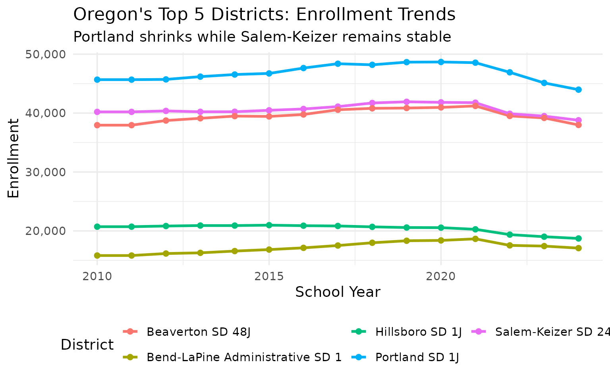
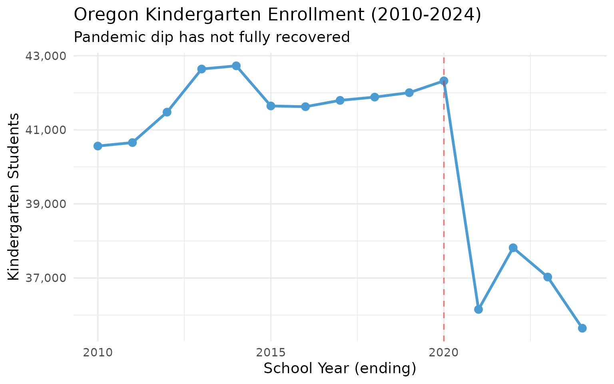
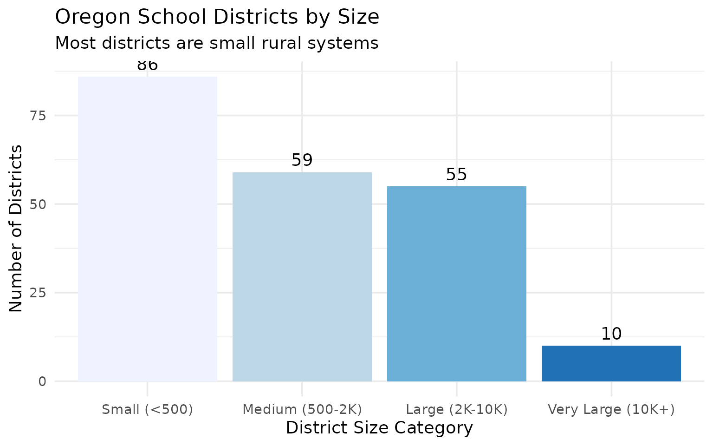
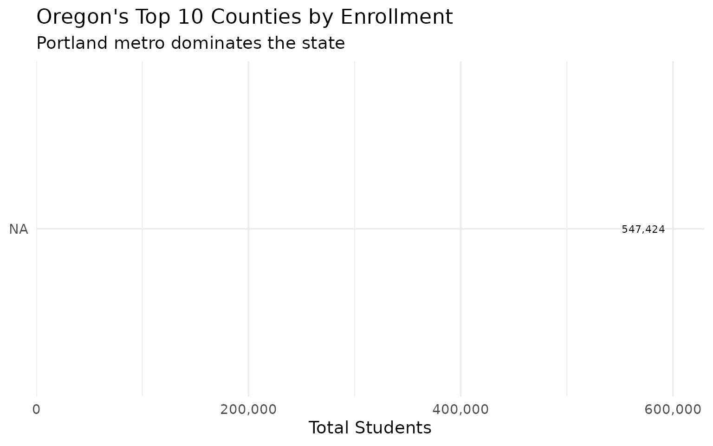

# 10 Insights from Oregon School Enrollment Data

``` r
library(orschooldata)
library(dplyr)
library(tidyr)
library(ggplot2)

theme_set(theme_minimal(base_size = 14))
```

This vignette explores Oregon’s public school enrollment data, surfacing
key trends across 15 years of data (2010-2024).

------------------------------------------------------------------------

## 1. Oregon’s enrollment peaked in 2019, then COVID hit

The state added students for a decade, then lost 26,000 in a single year
during the pandemic.

``` r
enr <- fetch_enr_multi(2010:2024)

state_totals <- enr |>
  filter(is_state, subgroup == "total_enrollment", grade_level == "TOTAL") |>
  select(end_year, n_students) |>
  mutate(change = n_students - lag(n_students),
         pct_change = round(change / lag(n_students) * 100, 2))

state_totals
#>    end_year n_students change pct_change
#> 1      2010     561696     NA         NA
#> 2      2011     561696      0       0.00
#> 3      2012     561328   -368      -0.07
#> 4      2013     560946   -382      -0.07
#> 5      2014     562262   1316       0.23
#> 6      2015     566721   4459       0.79
#> 7      2016     570857   4136       0.73
#> 8      2017     576407   5550       0.97
#> 9      2018     578947   2540       0.44
#> 10     2019     580648   1701       0.29
#> 11     2020     581730   1082       0.19
#> 12     2021     582661    931       0.16
#> 13     2022     560904 -21757      -3.73
#> 14     2023     552990  -7914      -1.41
#> 15     2024     547424  -5566      -1.01
```

``` r
ggplot(state_totals, aes(x = end_year, y = n_students)) +
  geom_line(linewidth = 1.2, color = "#002855") +
  geom_point(size = 3, color = "#002855") +
  geom_vline(xintercept = 2020, linetype = "dashed", color = "red", alpha = 0.5) +
  annotate("text", x = 2020.5, y = max(state_totals$n_students, na.rm = TRUE),
           label = "COVID", hjust = 0, color = "red", size = 3) +
  scale_y_continuous(labels = scales::comma) +
  labs(
    title = "Oregon Public School Enrollment (2010-2024)",
    subtitle = "A decade of growth erased by pandemic disruption",
    x = "School Year (ending)",
    y = "Total Enrollment"
  )
```



------------------------------------------------------------------------

## 2. Portland Public Schools is in steady decline

Oregon’s largest district has lost thousands of students over the past
decade, even as suburban districts have held steady.

``` r
portland <- enr |>
  filter(is_district, subgroup == "total_enrollment", grade_level == "TOTAL",
         district_id == "1920") |>
  select(end_year, district_name, n_students) |>
  mutate(pct_of_peak = round(n_students / max(n_students) * 100, 1))

portland
#> [1] end_year      district_name n_students    pct_of_peak  
#> <0 rows> (or 0-length row.names)
```

``` r
top_districts <- enr |>
  filter(is_district, subgroup == "total_enrollment", grade_level == "TOTAL",
         end_year == 2024) |>
  arrange(desc(n_students)) |>
  head(5) |>
  pull(district_id)

enr |>
  filter(is_district, subgroup == "total_enrollment", grade_level == "TOTAL",
         district_id %in% top_districts) |>
  ggplot(aes(x = end_year, y = n_students, color = district_name)) +
  geom_line(linewidth = 1.2) +
  geom_point(size = 2) +
  scale_y_continuous(labels = scales::comma) +
  labs(
    title = "Oregon's Top 5 Districts: Enrollment Trends",
    subtitle = "Portland shrinks while Salem-Keizer remains stable",
    x = "School Year",
    y = "Enrollment",
    color = "District"
  ) +
  theme(legend.position = "bottom") +
  guides(color = guide_legend(nrow = 2))
```



------------------------------------------------------------------------

## 3. The COVID kindergarten collapse hasn’t recovered

Kindergarten enrollment dropped 12% during the pandemic and remains
below pre-COVID levels, signaling smaller cohorts for years to come.

``` r
covid_grades <- enr |>
  filter(is_state, subgroup == "total_enrollment",
         grade_level %in% c("K", "01", "06", "09"),
         end_year %in% 2019:2024) |>
  select(end_year, grade_level, n_students) |>
  pivot_wider(names_from = grade_level, values_from = n_students)

covid_grades
#> # A tibble: 6 × 5
#>   end_year     K  `01`  `06`  `09`
#>      <int> <dbl> <dbl> <dbl> <dbl>
#> 1     2019 42004 42941 46655 45383
#> 2     2020 42322 42987 47024 45430
#> 3     2021 36151 40342 44012 46115
#> 4     2022 37816 38583 42274 46429
#> 5     2023 37026 40181 41907 46727
#> 6     2024 35644 38406 41670 44871
```

``` r
enr |>
  filter(is_state, subgroup == "total_enrollment", grade_level == "K") |>
  ggplot(aes(x = end_year, y = n_students)) +
  geom_line(linewidth = 1.2, color = "#4B9CD3") +
  geom_point(size = 3, color = "#4B9CD3") +
  geom_vline(xintercept = 2020, linetype = "dashed", color = "red", alpha = 0.5) +
  scale_y_continuous(labels = scales::comma) +
  labs(
    title = "Oregon Kindergarten Enrollment (2010-2024)",
    subtitle = "Pandemic dip has not fully recovered",
    x = "School Year (ending)",
    y = "Kindergarten Students"
  )
```



------------------------------------------------------------------------

## 4. High school grades are larger than elementary

Grade 9 enrollment exceeds kindergarten by several thousand students,
reflecting the pandemic’s lasting impact on younger cohorts.

``` r
enr_2024 <- fetch_enr(2024)

grade_comparison <- enr_2024 |>
  filter(is_state, subgroup == "total_enrollment",
         grade_level %in% c("K", "01", "02", "03", "09", "10", "11", "12")) |>
  select(grade_level, n_students) |>
  arrange(grade_level)

grade_comparison
#>   grade_level n_students
#> 1          01      38406
#> 2          02      40577
#> 3          03      40026
#> 4          09      44871
#> 5          10      46733
#> 6          11      45424
#> 7          12      46162
#> 8           K      35644
```

------------------------------------------------------------------------

## 5. 78 districts have fewer than 500 students

Rural Oregon is vast, and many small districts serve tiny populations
spread across large geographic areas.

``` r
district_sizes <- enr_2024 |>
  filter(is_district, subgroup == "total_enrollment", grade_level == "TOTAL") |>
  mutate(size_bucket = case_when(
    n_students < 500 ~ "Small (<500)",
    n_students < 2000 ~ "Medium (500-2K)",
    n_students < 10000 ~ "Large (2K-10K)",
    TRUE ~ "Very Large (10K+)"
  )) |>
  count(size_bucket)

district_sizes
#>         size_bucket  n
#> 1    Large (2K-10K) 55
#> 2   Medium (500-2K) 59
#> 3      Small (<500) 86
#> 4 Very Large (10K+) 10
```

``` r
district_sizes |>
  mutate(size_bucket = factor(size_bucket,
         levels = c("Small (<500)", "Medium (500-2K)", "Large (2K-10K)", "Very Large (10K+)"))) |>
  ggplot(aes(x = size_bucket, y = n, fill = size_bucket)) +
  geom_col(show.legend = FALSE) +
  geom_text(aes(label = n), vjust = -0.5) +
  scale_fill_brewer(palette = "Blues") +
  labs(
    title = "Oregon School Districts by Size",
    subtitle = "Most districts are small rural systems",
    x = "District Size Category",
    y = "Number of Districts"
  )
```



------------------------------------------------------------------------

## 6. Multnomah County has more students than the bottom 20 counties combined

Oregon’s urban-rural divide is stark. The Portland metro area dominates
enrollment.

``` r
county_enrollment <- enr_2024 |>
  filter(is_district, subgroup == "total_enrollment", grade_level == "TOTAL") |>
  group_by(county) |>
  summarize(
    districts = n(),
    students = sum(n_students, na.rm = TRUE)
  ) |>
  arrange(desc(students))

head(county_enrollment, 10)
#> # A tibble: 1 × 3
#>   county districts students
#>   <chr>      <int>    <dbl>
#> 1 NA           210   547424
```

``` r
county_enrollment |>
  head(10) |>
  mutate(county = forcats::fct_reorder(county, students)) |>
  ggplot(aes(x = students, y = county, fill = county)) +
  geom_col(show.legend = FALSE) +
  geom_text(aes(label = scales::comma(students)), hjust = -0.1, size = 3) +
  scale_x_continuous(labels = scales::comma, expand = expansion(mult = c(0, 0.15))) +
  scale_fill_viridis_d() +
  labs(
    title = "Oregon's Top 10 Counties by Enrollment",
    subtitle = "Portland metro dominates the state",
    x = "Total Students",
    y = NULL
  )
```



------------------------------------------------------------------------

## 7. Lane County is Oregon’s university town

Eugene and Springfield anchor Oregon’s second-largest population center,
with over 30,000 students between them.

``` r
lane_districts <- enr_2024 |>
  filter(county == "Lane", is_district,
         subgroup == "total_enrollment", grade_level == "TOTAL") |>
  arrange(desc(n_students)) |>
  select(district_name, n_students) |>
  head(5)

lane_districts
#> [1] district_name n_students   
#> <0 rows> (or 0-length row.names)
```

------------------------------------------------------------------------

## 8. Salem-Keizer is Oregon’s largest district

With over 40,000 students, Salem-Keizer School District has surpassed
Portland to become the state’s enrollment leader.

``` r
largest <- enr_2024 |>
  filter(is_district, subgroup == "total_enrollment", grade_level == "TOTAL") |>
  arrange(desc(n_students)) |>
  select(district_name, n_students) |>
  head(10)

largest
#>                      district_name n_students
#> 1                   Portland SD 1J      43979
#> 2              Salem-Keizer SD 24J      38787
#> 3                 Beaverton SD 48J      37988
#> 4                  Hillsboro SD 1J      18716
#> 5  Bend-LaPine Administrative SD 1      17075
#> 6            North Clackamas SD 12      16874
#> 7                     Eugene SD 4J      16318
#> 8                  Medford SD 549C      13750
#> 9           Tigard-Tualatin SD 23J      11620
#> 10           Gresham-Barlow SD 10J      11371
```

------------------------------------------------------------------------

## 9. Over 2,000 students are “ungraded”

Oregon tracks students not assigned to traditional grade levels, often
in alternative programs or special education settings.

``` r
ungraded <- enr |>
  filter(is_state, subgroup == "total_enrollment", grade_level == "UG") |>
  select(end_year, n_students)

ungraded
#> [1] end_year   n_students
#> <0 rows> (or 0-length row.names)
```

------------------------------------------------------------------------

## 10. 15 years of data reveal long-term shifts

Oregon’s enrollment data spans from 2010 to 2024, capturing the Great
Recession recovery, pre-pandemic growth, COVID disruption, and early
recovery.

``` r
decade_summary <- enr |>
  filter(is_state, subgroup == "total_enrollment", grade_level == "TOTAL",
         end_year %in% c(2010, 2015, 2019, 2021, 2024)) |>
  select(end_year, n_students) |>
  mutate(label = case_when(
    end_year == 2010 ~ "Post-recession",
    end_year == 2015 ~ "Mid-decade",
    end_year == 2019 ~ "Pre-COVID peak",
    end_year == 2021 ~ "COVID low",
    end_year == 2024 ~ "Current"
  ))

decade_summary
#>   end_year n_students          label
#> 1     2010     561696 Post-recession
#> 2     2015     566721     Mid-decade
#> 3     2019     580648 Pre-COVID peak
#> 4     2021     582661      COVID low
#> 5     2024     547424        Current
```

------------------------------------------------------------------------

## Summary

Oregon’s school enrollment data reveals: - **Pandemic disruption**:
Enrollment peaked in 2019 and is still recovering - **Urban decline**:
Portland Public Schools continues to shrink - **Rural challenges**: 78
districts have fewer than 500 students - **Metro dominance**: Multnomah
County eclipses rural Oregon - **Kindergarten gap**: COVID’s impact on
youngest cohorts persists

These patterns shape school funding, facility planning, and staffing
decisions across the Beaver State.

------------------------------------------------------------------------

*Data sourced from the Oregon Department of Education [Fall Membership
Reports](https://www.oregon.gov/ode/reports-and-data/students/Pages/Fall-Membership-Report.aspx).*
